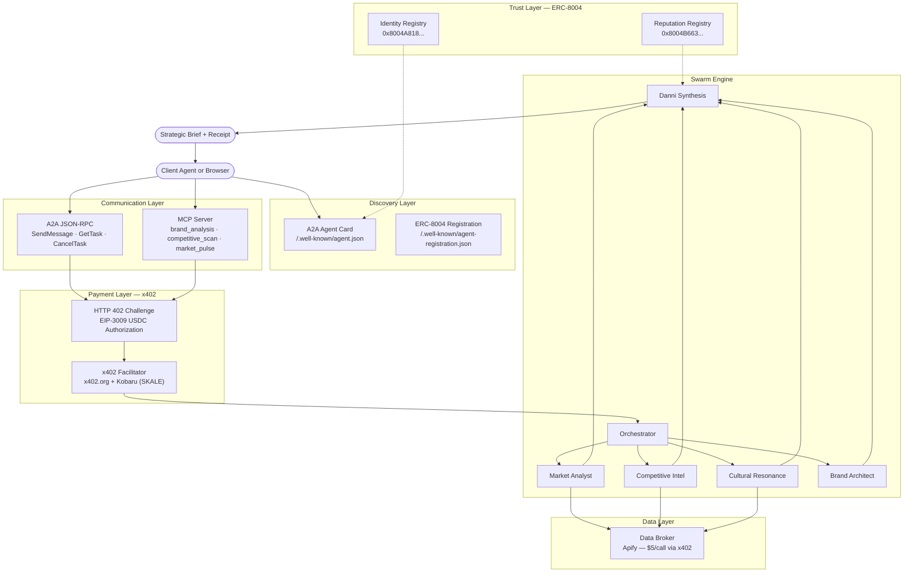
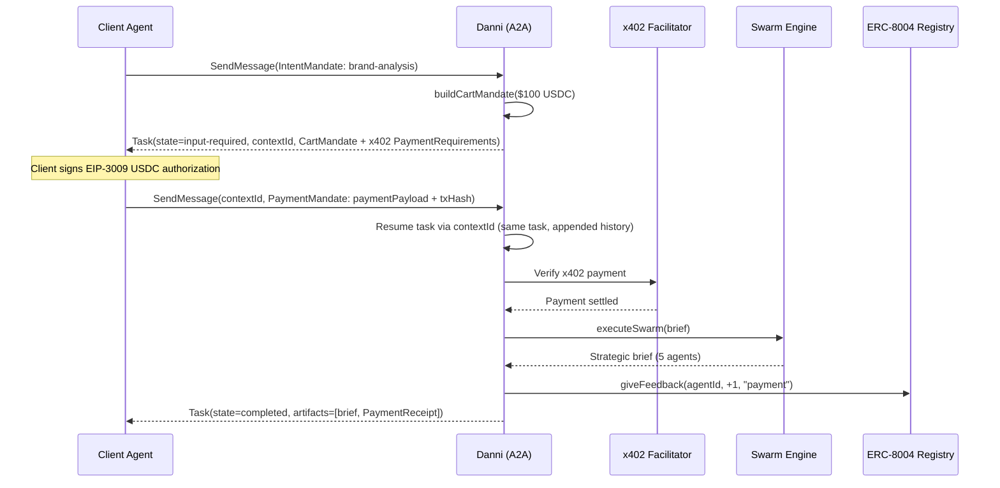

# Danni — Autonomous Brand Strategist

> Five AI analysts. One strategic brief. $100 USDC settled on-chain.

Danni is a swarm-intelligence brand strategist that produces agency-grade strategic briefs via the x402 payment protocol. A client pays $100 USDC on Base Sepolia; five specialist agents — Market Analyst, Competitive Intel, Cultural Resonance, Brand Architect, and Danni Synthesis — execute in parallel, purchase live market data through paywalled endpoints, and deliver a unified brief a creative director could build a campaign from.

Every agent activation, every payment, every insight is streamed to a glass-box UI in real-time. Clients see exactly what they're paying for.

**Built with:** SvelteKit 2 + Svelte 5 | TypeScript | Bun | x402 (`@x402/core`, `@x402/evm`, `@x402/fetch`) | viem | Base Sepolia USDC | Zod

---

## Architecture



---

## Protocol Compliance

Danni implements the full agentic commerce stack. No other entry demonstrates all four layers together.

| Protocol | Spec | Implementation | Status |
|----------|------|----------------|--------|
| **x402** | HTTP 402 + EIP-3009 | Custom SvelteKit adapter (`HTTPAdapter` → `RequestEvent`). Server: `@x402/core` + `@x402/evm`. Client: `@x402/fetch` with wallet signer. | Complete |
| **A2A** | v0.3 JSON-RPC | Agent Card at `/.well-known/agent.json`. PascalCase methods (`SendMessage`, `GetTask`, `CancelTask`). Response envelope `{ task: {...} }`. Extensions: AP2 + ERC-8004. | Complete |
| **MCP** | 2025-06-18 | `tools/list` + `tools/call` with x402 payment gating via `_meta["x402/payment"]`. Payment required returns `isError: true` with requirements. Payment response includes settlement receipt. | Complete |
| **AP2** | v0.2 embedded flow | IntentMandate → CartMandate (embedded x402 PaymentRequiredResponse) → PaymentMandate → PaymentReceipt. Status tracking via `x402.payment.*` metadata keys. First TypeScript implementation. | Complete |
| **ERC-8004** | Identity + Reputation | Identity Registry `0x8004A818...` on Base Sepolia. Reputation Registry `0x8004B663...`. Agent registration JSON at `/.well-known/agent-registration.json`. Feedback submitted post-payment. | Complete |
| **SKALE** | Dual-chain | Alternative zero-gas payment path via SKALE Europa Hub (`eip155:1444673419`) with Kobaru facilitator. Declared in Agent Card `alternativeNetworks`. | Declared |

---

## AP2 Payment Flow



---

## The Full Loop

```
discover → trust → communicate → pay → deliver → rate
   A2A     ERC-8004    A2A/MCP     x402   Swarm   ERC-8004
```

1. **Discover** — Client reads `/.well-known/agent.json`, finds Danni's skills and pricing
2. **Trust** — Client checks ERC-8004 Identity Registry, reads reputation score
3. **Communicate** — Client calls `SendMessage` (A2A) or `tools/call` (MCP) with a brand brief
4. **Pay** — Server returns HTTP 402; client signs EIP-3009 USDC authorization; facilitator settles
5. **Deliver** — Five agents execute in parallel, streaming progress via SSE
6. **Rate** — Positive reputation feedback submitted on-chain via `giveFeedback()`

---

## Pricing

| Skill | Price | Protocol |
|-------|-------|----------|
| `brand_analysis` — Full strategic brief (5 agents) | $100 USDC | x402 on Base Sepolia |
| `competitive_scan` — Competitor landscape | $5 USDC | x402 on Base Sepolia |
| `market_pulse` — Industry dynamics | $5 USDC | x402 on Base Sepolia |

All prices are in USDC on Base Sepolia (chain `eip155:84532`). Settlement is immediate and verifiable on-chain.

---

## Endpoints

| Endpoint | Method | Description |
|----------|--------|-------------|
| `/.well-known/agent.json` | GET | A2A Agent Card — discovery, skills, pricing, extensions |
| `/.well-known/agent-registration.json` | GET | ERC-8004 registration-v1 schema |
| `/api/a2a` | POST | A2A JSON-RPC handler with AP2 mandate lifecycle |
| `/api/mcp` | POST | MCP tool server with x402 payment gating |
| `/api/danni/analyze` | POST | Direct swarm endpoint — $100 USDC |
| `/api/data/competitive` | POST | Competitive intel — $5 USDC |
| `/api/data/social` | POST | Social listening — $5 USDC |
| `/api/data/market` | POST | Market trends — $5 USDC |

---

## Live Demo

**Production**: [https://danni.subfrac.cloud](https://danni.subfrac.cloud)

```bash
# Verify live agent card
curl https://danni.subfrac.cloud/.well-known/agent.json | jq .name

# Verify live MCP tools
curl -s -X POST https://danni.subfrac.cloud/api/mcp \
  -H 'Content-Type: application/json' \
  -d '{"jsonrpc":"2.0","id":1,"method":"tools/list"}' | jq '.result.tools[].name'

# Verify live AP2 flow
curl -s -X POST https://danni.subfrac.cloud/api/a2a \
  -H 'Content-Type: application/json' \
  -d '{"jsonrpc":"2.0","id":1,"method":"SendMessage","params":{"message":{"role":"user","parts":[{"type":"data","mimeType":"application/json","data":{"type":"ap2.mandates.IntentMandate","skillId":"brand-analysis","description":"Analyze Notion"}}]}}}' | jq '.result.task.status.state'
```

---

## Getting Started

```bash
git clone https://github.com/domocarroll/danni-x402.git
cd x402-hackathon/app
bun install
cp .env.example .env
```

Edit `.env`:

```env
WALLET_ADDRESS=0x...          # Receives USDC payments (public)
WALLET_PRIVATE_KEY=0x...      # Signs x402 receipts (secret)
APIFY_API_KEY=apify_api_...   # Market data from Apify
USE_CLI=true                  # Use claude -p backend (default)
```

Run:

```bash
bun run dev          # http://localhost:5173
bun run check        # TypeScript verification (0 errors required)
bun run build        # Production build
bun run test         # 264 tests across 10 suites — AP2, x402-flow, task manager, mandate extraction, MCP + error classification, ERC-8004, config, data fallbacks, transaction store, semantic web builder
```

Register on-chain (requires Base Sepolia ETH for gas):

```bash
bun run scripts/register-agent.ts
```

---

## Demo

### 1. Connect Wallet
Open `http://localhost:5173/chat`. Click **Connect Wallet**. MetaMask prompts for Base Sepolia.

### 2. Submit a Brief
> "Analyze the brand positioning of Notion in the productivity space"

### 3. Pay
The server returns HTTP 402. `@x402/fetch` signs an EIP-3009 USDC authorization and retries automatically. Settlement happens on-chain.

### 4. Watch the Swarm
Five agent cards light up in sequence: Market Analyst gathers data, Competitive Intel maps the landscape, Cultural Resonance reads the cultural moment, Brand Architect frames the positioning, Danni Synthesis produces the final brief.

### 5. Receive the Brief
A strategic brief suitable for a creative director. The transaction hash links to Base Sepolia block explorer. Reputation feedback is submitted to the ERC-8004 Reputation Registry.

### Verify Protocol Compliance

```bash
# A2A Agent Card (discovery)
curl http://localhost:5173/.well-known/agent.json | jq .

# ERC-8004 registration
curl http://localhost:5173/.well-known/agent-registration.json | jq .

# MCP tools/list
curl -X POST http://localhost:5173/api/mcp \
  -H 'Content-Type: application/json' \
  -d '{"jsonrpc":"2.0","id":1,"method":"tools/list"}'
```

### Full AP2 Payment Flow (curl)

```bash
# Step 1: IntentMandate → receive CartMandate + contextId
RESPONSE=$(curl -s -X POST http://localhost:5173/api/a2a \
  -H 'Content-Type: application/json' \
  -d '{
    "jsonrpc": "2.0", "id": 1,
    "method": "SendMessage",
    "params": {
      "message": {
        "role": "user",
        "parts": [{
          "type": "data",
          "mimeType": "application/json",
          "data": {
            "type": "ap2.mandates.IntentMandate",
            "skillId": "brand-analysis",
            "description": "Analyze brand positioning of Notion"
          }
        }]
      }
    }
  }')

# Extract contextId for payment resumption
CONTEXT_ID=$(echo "$RESPONSE" | jq -r '.result.task.contextId')
echo "Task state: $(echo "$RESPONSE" | jq -r '.result.task.status.state')"
echo "Context ID: $CONTEXT_ID"

# Step 2: PaymentMandate with same contextId → resumes original task
curl -s -X POST http://localhost:5173/api/a2a \
  -H 'Content-Type: application/json' \
  -d "{
    \"jsonrpc\": \"2.0\", \"id\": 2,
    \"method\": \"SendMessage\",
    \"params\": {
      \"contextId\": \"$CONTEXT_ID\",
      \"message\": {
        \"role\": \"user\",
        \"parts\": [
          {
            \"type\": \"data\",
            \"mimeType\": \"application/json\",
            \"data\": {
              \"type\": \"ap2.mandates.PaymentMandate\",
              \"paymentPayload\": \"eip3009-signed-authorization\",
              \"transactionHash\": \"0xabc123\"
            }
          },
          {
            \"type\": \"text\",
            \"text\": \"Analyze brand positioning of Notion in the productivity space\"
          }
        ]
      }
    }
  }" | jq '.result.task | {id, contextId, state: .status.state, artifacts: (.artifacts | length)}'
```

---

## How It Was Built

Three Fates — Clotho, Lachesis, Atropos — orchestrated parallel AI builders through tmux sessions. Each launched an independent agent (Claude Opus 4.6) on its assigned phase. Phases 3, 4, and 5 were built simultaneously in 12 minutes of wall-clock time: 25 files, zero type errors, zero file conflicts.

The build process is the product. Danni is a brand strategist built by the same swarm intelligence she uses to analyze brands.

Build provenance is preserved in `.fates/`:

```
.fates/
  loom/loom.md             # Narrative of the build
  provenance/threads.md    # Decision chain with causal links
  analysis/                # Protocol gap analysis, drift detection
```

---

## Hackathon Tracks

| Track | Prize | What We Demonstrate |
|-------|-------|---------------------|
| **x402 Payment Protocol** | Primary | First SvelteKit x402 adapter. Real USDC settlement. Client + server. |
| **ERC-8004 Identity** | $9,500 | On-chain agent registration + reputation feedback loop. |
| **AP2 Agentic Payments** | $13,000 | First TypeScript AP2 v0.2. Full mandate lifecycle inside A2A. |
| **A2A Agent Interop** | Google | Full Agent Card, JSON-RPC handler, AP2 + ERC-8004 extensions. |
| **MCP Tool Server** | AI Tooling | Three tools with x402 payment gating via `_meta`. |
| **Innovation** | General | Glass-box UI. Swarm intelligence. Strategic frameworks (Ogilvy, Fallon, Holt). |

---

## The Canon

Danni's strategic intelligence draws from three canonical texts:

- **Ogilvy** (*Confessions*) — Research-first. Facts sell. The Big Idea test.
- **Fallon/Senn** (*Juicing the Orange*) — Ruthlessly simple problem. Proprietary emotion.
- **Holt** (*How Brands Become Icons*) — Cultural contradictions. Identity myths.

Agents synthesize top-down: Holt (cultural tension) → Fallon (brand ownership) → Ogilvy (proof). The productive tension between these perspectives is encoded into the swarm's parallel execution.

---

## License

MIT
