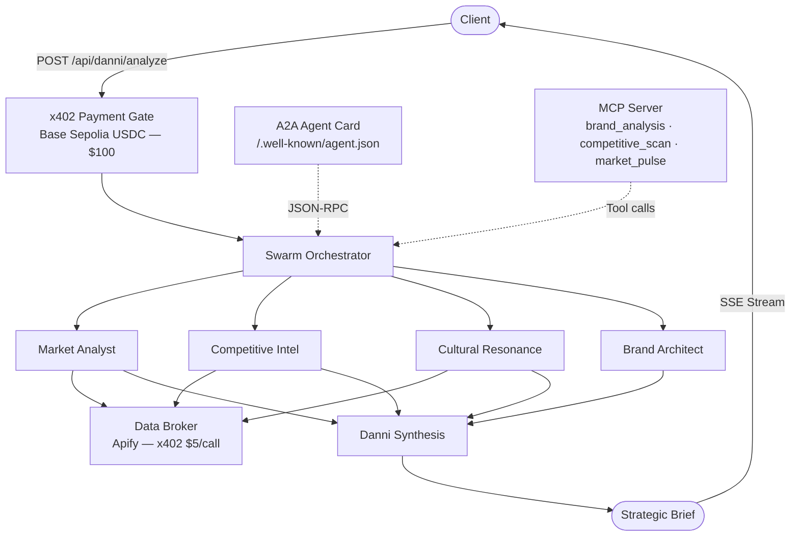

# Danni

**Autonomous Brand Strategist powered by x402**

---

## What It Does

Danni is an x402-powered AI swarm that produces strategic brand briefs worth $100 USDC. Five specialist AI analysts -- Market, Competitive, Cultural, Brand Architecture, and Synthesis -- work in parallel, purchasing real market data through paywalled endpoints and producing a unified strategic brief a creative director could build a campaign from. Every step is visible in real-time through a glass-box UI, and every payment settles on-chain via the x402 protocol on Base Sepolia.

---

## Architecture



---

## Key Features

**x402 Protocol** -- First-ever SvelteKit x402 adapter. Custom `HTTPAdapter` implementation wrapping SvelteKit's `RequestEvent` into the x402 payment middleware. All endpoints are paywalled on-chain.

**Swarm Intelligence** -- Five parallel AI analysts with domain-specific system prompts drawn from strategic frameworks (Ogilvy, Fallon/Senn, Holt). Each agent operates with its own cognitive lens; synthesis merges their outputs into a cohesive brief.

**Real Data** -- Apify-backed competitive intelligence (Google Search), social listening (Twitter scraper), and market trends (Google Trends). Cache-first with hardcoded fallback for demo reliability.

**Glass Box** -- Real-time SSE streaming of agent activity. The UI shows each analyst activating, thinking, and producing -- clients see exactly what they are paying for.

**Agent Interop** -- A2A (Agent-to-Agent) protocol via `/.well-known/agent.json` and JSON-RPC handler, plus an MCP server exposing `brand_analysis`, `competitive_scan`, and `market_pulse` as callable tools. Both protocols delegate to the same backend.

**Strategic Frameworks** -- Methodology grounded in three canonical texts: Ogilvy's *Confessions* (craft layer), Fallon/Senn's *Juicing the Orange* (execution layer), and Holt's *How Brands Become Icons* (vision layer). Agents synthesize top-down: Holt to Fallon to Ogilvy.

---

## Tech Stack

| Layer | Technology |
|-------|-----------|
| Framework | SvelteKit 2 + Svelte 5 (runes) |
| Language | TypeScript (strict mode) |
| Runtime | Bun |
| Payments | x402 Protocol (`@x402/core`, `@x402/evm`) |
| Chain | Base Sepolia (EIP-155:84532, USDC) |
| Validation | Zod |
| Market Data | Apify (Google Search, Twitter, Google Trends) |
| Agent Interop | A2A Protocol + MCP Server |
| Styling | Scoped Svelte styles, dark theme |

---

## Quick Start

```bash
git clone <repository-url>
cd app
bun install
cp .env.example .env   # Add your keys — see Environment Variables below
bun run dev             # Dev server at localhost:5173
```

### Build and Verify

```bash
bun run check    # TypeScript + svelte-check (0 errors required)
bun run build    # Production build
bun run preview  # Preview production build
```

---

## Project Structure

```
src/
  routes/
    +page.svelte                            # Landing page
    +layout.svelte                          # Global layout
    chat/+page.svelte                       # Chat interface with SSE streaming
    dashboard/+page.svelte                  # Payment history dashboard
    api/
      danni/analyze/+server.ts              # Main swarm endpoint ($100)
      data/competitive/+server.ts           # Competitive intel ($5)
      data/social/+server.ts                # Social listening ($5)
      data/market/+server.ts                # Market trends ($5)
      payments/history/+server.ts           # Transaction history
      a2a/+server.ts                        # A2A JSON-RPC handler
      mcp/+server.ts                        # MCP tool server
    .well-known/agent.json/+server.ts       # A2A Agent Card
  lib/
    x402/                                   # SvelteKit x402 adapter + middleware
    swarm/
      orchestrator.ts                       # executeSwarm() — parallel agent execution
      tracker.ts                            # SubagentTracker for event recording
      streaming-tracker.ts                  # SSE event emission
      agents/                               # 5 specialist agent prompt modules
        market-analyst.ts
        competitive-intel.ts
        cultural-resonance.ts
        brand-architect.ts
        danni-synthesis.ts
    llm/
      provider.ts                           # LLMProvider interface
      cli-backend.ts                        # claude -p CLI backend
    data/
      apify-client.ts                       # Apify actor runner
      cache.ts                              # File-based JSON cache (1hr TTL)
      fallback.ts                           # Hardcoded demo data
    a2a/
      types.ts                              # A2A protocol types
      task-manager.ts                       # A2A task lifecycle
    mcp/
      tools.ts                              # MCP tool definitions
      handlers.ts                           # MCP tool handlers
    stores/
      chat.svelte.ts                        # Chat state (Svelte 5 runes)
      swarm.svelte.ts                       # Swarm activity state
      payments.svelte.ts                    # Payment flow state
    components/
      MessageBubble.svelte                  # Chat message display
      AgentCard.svelte                      # Individual agent status
      SwarmViz.svelte                       # Swarm activity visualization
      PaymentFlow.svelte                    # Payment step indicator
    types/                                  # Shared TypeScript interfaces + Zod schemas
    config/                                 # Constants, route config, pricing
  hooks.server.ts                           # x402 payment middleware
```

---

## Environment Variables

| Variable | Required | Description |
|----------|----------|-------------|
| `WALLET_ADDRESS` | Yes | Ethereum address that receives USDC payments. Public — safe to commit. |
| `WALLET_PRIVATE_KEY` | Yes | Private key for the wallet above. Used by x402 to verify payment receipts. Never commit this. |
| `APIFY_API_KEY` | Yes | Apify API token for market data actors (competitive, social, trends). |
| `USE_CLI` | No | Set to `true` to use `claude -p` CLI backend (default). Omit or set `false` for Anthropic API. |
| `ANTHROPIC_API_KEY` | No | Required only if `USE_CLI` is not `true`. Anthropic API key for the Agent SDK backend. |
| `ELEVENLABS_API_KEY` | No | ElevenLabs API key for voice synthesis. Danni narrates the strategic brief. |
| `FACILITATOR_URL` | No | x402 facilitator endpoint. Defaults to `https://x402.org/facilitator`. |
| `NETWORK` | No | Target chain. Defaults to `eip155:84532` (Base Sepolia). |
| `PUBLIC_BASE_URL` | No | Server base URL. Defaults to `http://localhost:5173`. |

---

## How It Was Built

This project was built by a meta-cognitive AI swarm.

Three Fates -- Clotho, Lachesis, Atropos -- oversaw three parallel AI builders through tmux sessions. Each Fate launched an OpenCode Sisyphus instance (Claude Opus 4.6) and watched its assigned phase: Clotho guarded the Data Broker, Lachesis the Frontend Shell, Atropos the Agent Interop layer. A fourth system, the Loom, wove their observations into a provenance chain -- a semantic record of every decision, self-correction, and emergent pattern.

**Phases 3, 4, and 5 were built simultaneously in 12 minutes of wall-clock time.** 25 files. Zero type errors. Zero file conflicts between independent builders. The agents independently chose the same design tokens without coordination -- emergent convergence from shared architectural constraints.

The provenance chain is preserved in `.fates/` and included in this repository:

```
.fates/
  loom/loom.md             # The Loom's narrative of the build
  provenance/threads.md    # Decision chain with causal links
  analysis/current.md      # Drift analysis between agents
  prompts/                 # The exact prompts that launched each builder
```

The build process is the product. Danni is a brand strategist built by the same kind of swarm intelligence she uses to analyze brands. The architecture is fractal -- the same pattern of parallel specialist agents producing a unified synthesis operates at every level, from the codebase to the deliverable.

### Build Timeline

| Phase | What | Duration | Files |
|-------|------|----------|-------|
| 1. Foundation | SvelteKit + x402 adapter + payment middleware | Session 02 | 6 |
| 2. Swarm Engine | 5-agent orchestrator + LLM backend + prompts | Session 02 | 10 |
| 3. Data Broker | 3 Apify endpoints + cache + fallback | 4m 17s | 7 |
| 4. Frontend Shell | Landing + chat + dashboard + components + stores | 11m 46s | 10 |
| 5. Agent Interop | A2A + MCP + 3 protocol endpoints | 6m 41s | 7 |
| 6. Integration | SSE streaming + endpoint wiring + MCP/A2A backends | Session 03 | 8 |

---

## The Canon

Danni's strategic intelligence is grounded in three texts that form her analytical foundation:

**Layer 1 -- Craft** (Ogilvy, *Confessions of an Advertising Man*): Research-first methodology. Facts sell. The Big Idea test. Every claim must be substantiated.

**Layer 2 -- Execution** (Fallon/Senn, *Juicing the Orange*): Ruthlessly simple problem definition. Proprietary emotion. Creative solutions emerge from precise constraints.

**Layer 3 -- Vision** (Holt, *How Brands Become Icons*): Cultural contradictions. Identity myths. Brands succeed by addressing the anxieties of their moment.

The agents synthesize top-down: Holt (what cultural tension exists) to Fallon (what the brand can own) to Ogilvy (how to prove it). The books argue with each other productively -- consistency versus breakthrough, facts versus myths -- and that productive tension is encoded into the swarm's parallel analysis.

---

## License

MIT
